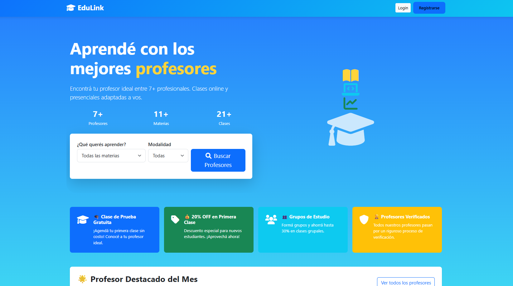
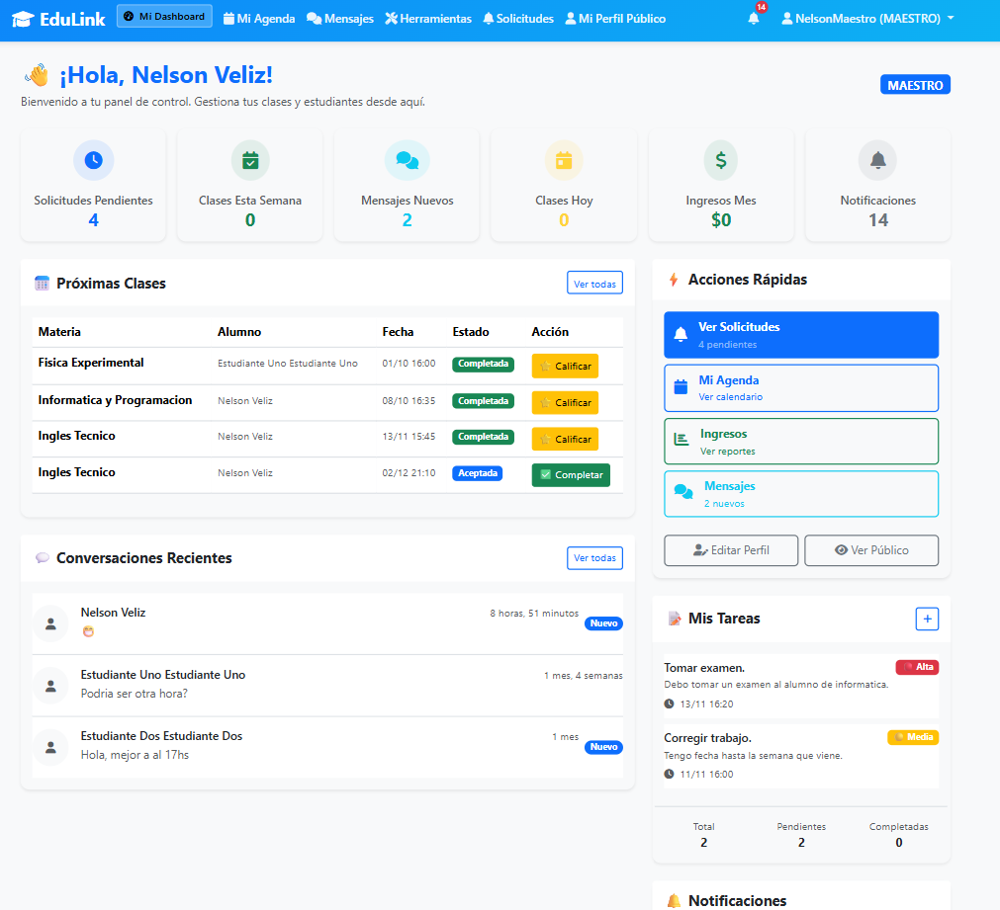
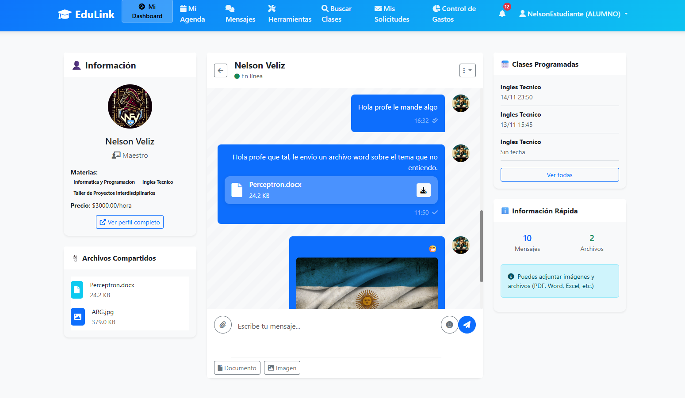
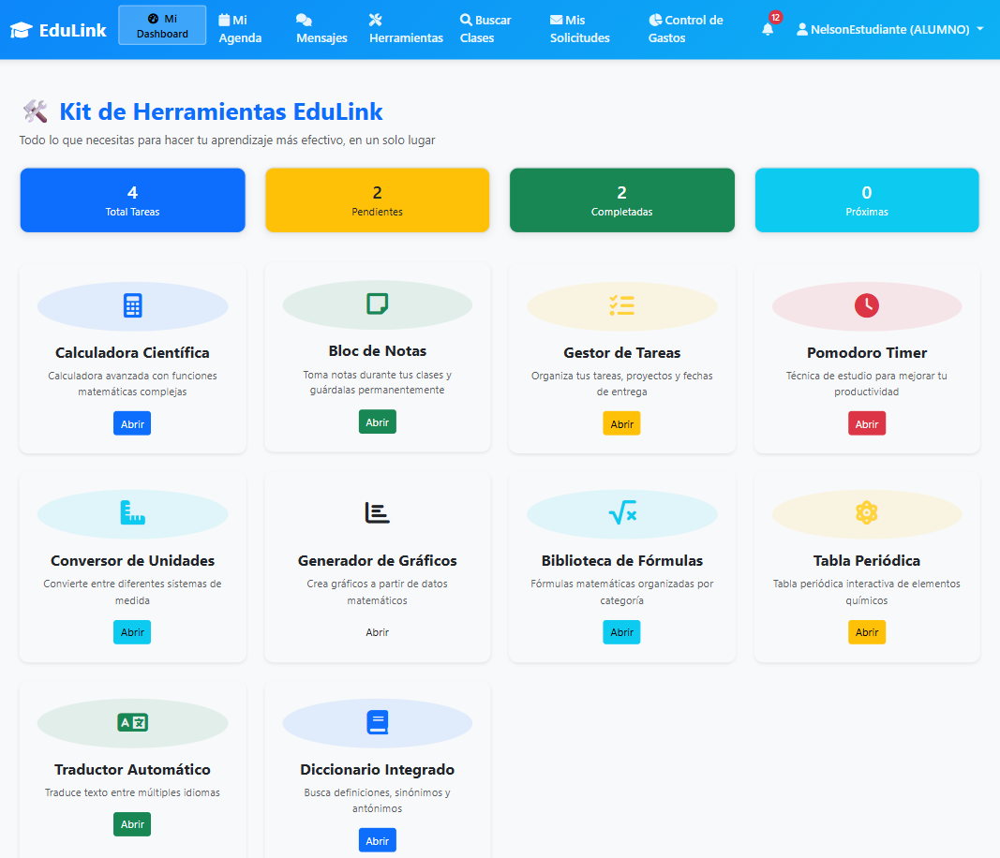
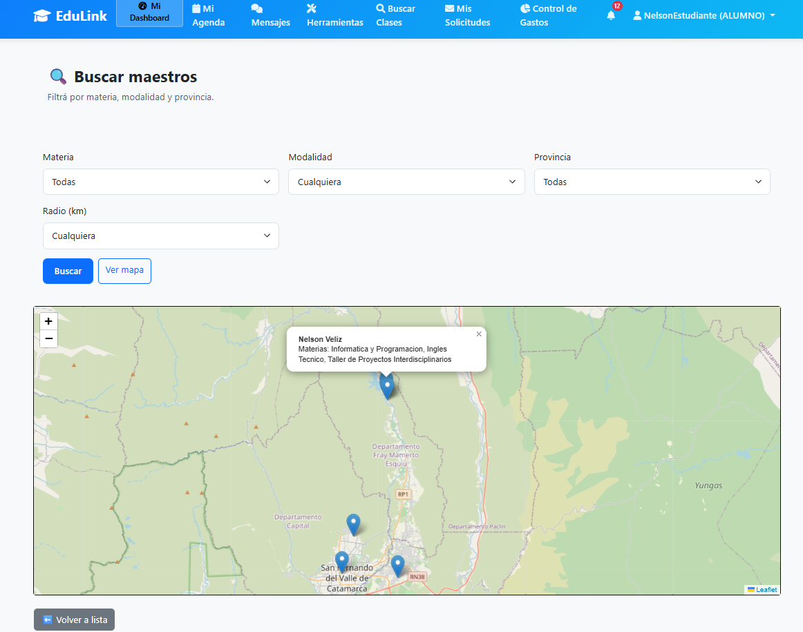
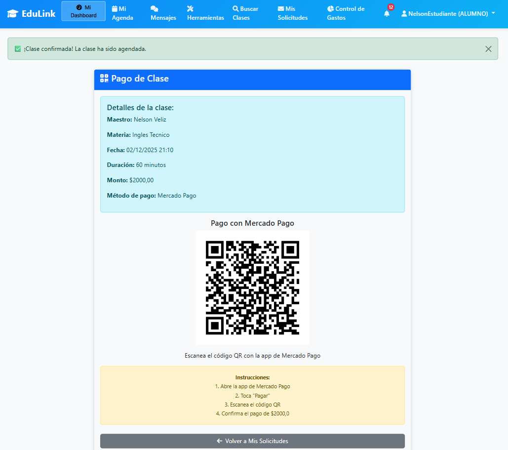
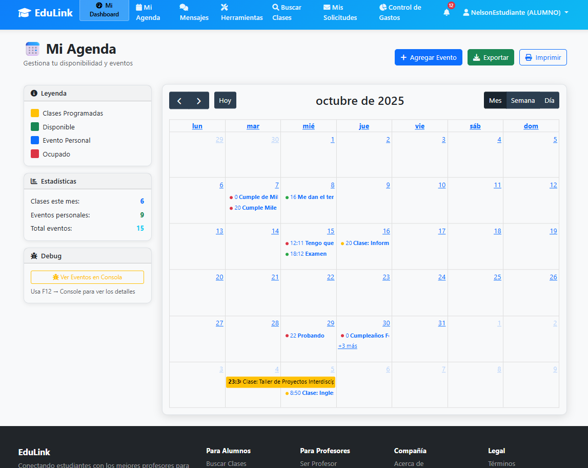

---

# 🧠📚 **EduLink – Plataforma Educativa Integral**



---

## 🚀 **Descripción General**

**EduLink** es una plataforma educativa completa creada para conectar **estudiantes y docentes** de manera sencilla, rápida y profesional.
Integra herramientas modernas para gestionar clases, organizar tareas, comunicar usuarios y mejorar el proceso educativo a través de tecnología web.

EduLink no es solo un sistema de gestión: es un **ecosistema digital** diseñado para optimizar la enseñanza, el aprendizaje y la administración de servicios educativos.

---

## ✨ **Características Principales**

### 👥 Gestión de Usuarios y Roles

* Rol **Administrador**
* Rol **Docente**
* Rol **Alumno**
* Rol **Invitado** (vista previa limitada)
* Paneles personalizados según el rol
* Edición de perfil, reseñas, control de clases, verificación por email y más

---

### 📊 Dashboard Inteligente

* Estadísticas del docente (alumnos, ingresos, reseñas, clases)
* Estadísticas del estudiante (estado académico, gastos, historial)
* Gráficos dinámicos
* Exportación y reportes PDF




---

### 💬 Sistema de Comunicación Interna

* Chat en tiempo real entre docente y alumno
* Notificaciones inteligentes
* Historial de mensajes
* Sistema seguro y privado



---

### 🧰 Herramientas de Estudio Integradas

Incluye herramientas exclusivas para facilitar el aprendizaje:

* 🧮 Calculadora científica
* 📝 Bloc de notas
* 🕒 Pomodoro Timer
* 📘 Gestor de tareas
* 🔢 Conversor de unidades
* 📊 Generador de gráficos
* 📚 Biblioteca de fórmulas matemáticas
* 🧪 Tabla periódica interactiva
* 🌎 Traductor automático
* 📖 Diccionario integrado



---

### 👨‍🏫👩‍🎓 Conexión Estudiante–Docente

* Mapa interactivo (profesores cercanos)
* Perfiles públicos y privados
* Reservas de clases
* Reseñas de ambos lados




---

### 💳 Pagos y Control Financiero

* Gestión de pagos por clases
* Resumen de gastos (alumnos)
* Resumen de ingresos (docentes)
* Tablas dinámicas y filtros




---

### 📅 Agenda & Calendario Interactivo

* Calendario con eventos
* Agenda personal
* Exportación de actividades
* Recordatorios



---

## 🛠️ **Tecnologías Utilizadas**

* Python
* Django
* Django REST Framework
* HTML
* CSS
* Bootstrap
* JavaScript
* PostgreSQL

---

## 📦 **Instalación (Opcional, pero profesional)**

```bash
git clone https://github.com/TU_USUARIO/EduLink.git
cd EduLink

pip install -r requirements.txt

python manage.py migrate
python manage.py runserver
```

---

## 📬 **Contacto**

**Nelson Fernando Veliz**
Desarrollador Web & Software – Semi Senior
🔗 LinkedIn: *https://www.linkedin.com/in/nelson-fernando-veliz-395423283/*
📧 Email: *veliznelson041@gmail.com*

---
