# 🧠📚 EduLink – Plataforma Educativa Integral

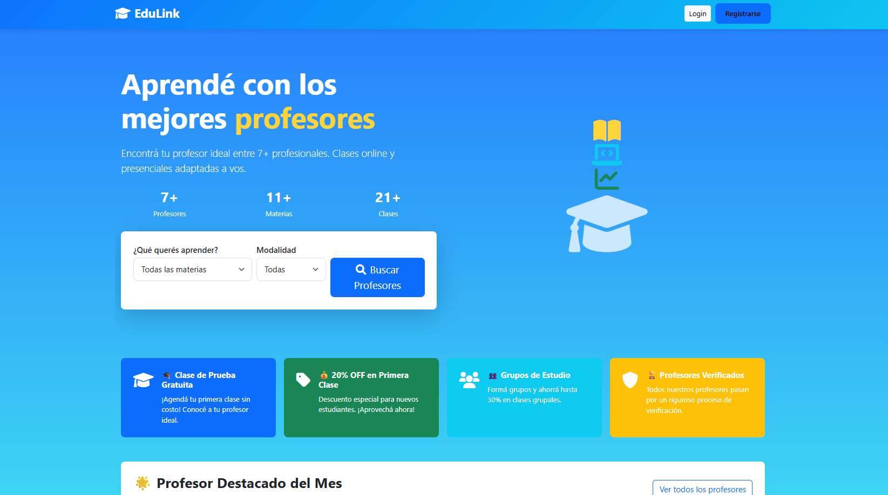


---

## 🚀 Descripción General

**EduLink** es una plataforma web educativa diseñada para conectar **alumnos y profesores particulares** de manera sencilla, rápida y profesional.

Digitaliza el proceso completo de contratación de clases particulares: desde la búsqueda y selección de un profesor, pasando por la coordinación de horarios, hasta la finalización y calificación de cada clase. Integra herramientas de comunicación interna, gestión de agenda, control financiero y un panel administrativo completo.

EduLink no es solo un sistema de gestión: es un **ecosistema digital** diseñado para optimizar la enseñanza, el aprendizaje y la administración de servicios educativos.

---

## 👥 Roles del Sistema

| Rol | Descripción |
|-----|-------------|
| **Administrador** | Gestión completa del sistema, usuarios, estadísticas y control de acceso |
| **Profesor** | Gestiona su perfil, disponibilidad, solicitudes de clase e ingresos |
| **Alumno** | Busca profesores, solicita clases, gestiona agenda y controla gastos |
| **Invitado** | Acceso de solo lectura al home público de la plataforma |

---

## ✨ Características Principales

### 📊 Dashboard Personalizado por Rol

Cada usuario tiene un panel adaptado a su perfil:

- **Dashboard Alumno:** próximas clases, estado de solicitudes, historial, accesos directos a profesores, agenda, gastos y mensajes.
- **Dashboard Profesor:** solicitudes pendientes, clases programadas, historial, notificaciones recientes y mensajes no leídos.
- **Dashboard Administrador:** totales de usuarios, clases, solicitudes activas, estadísticas desglosadas por rol y accesos a gestión.

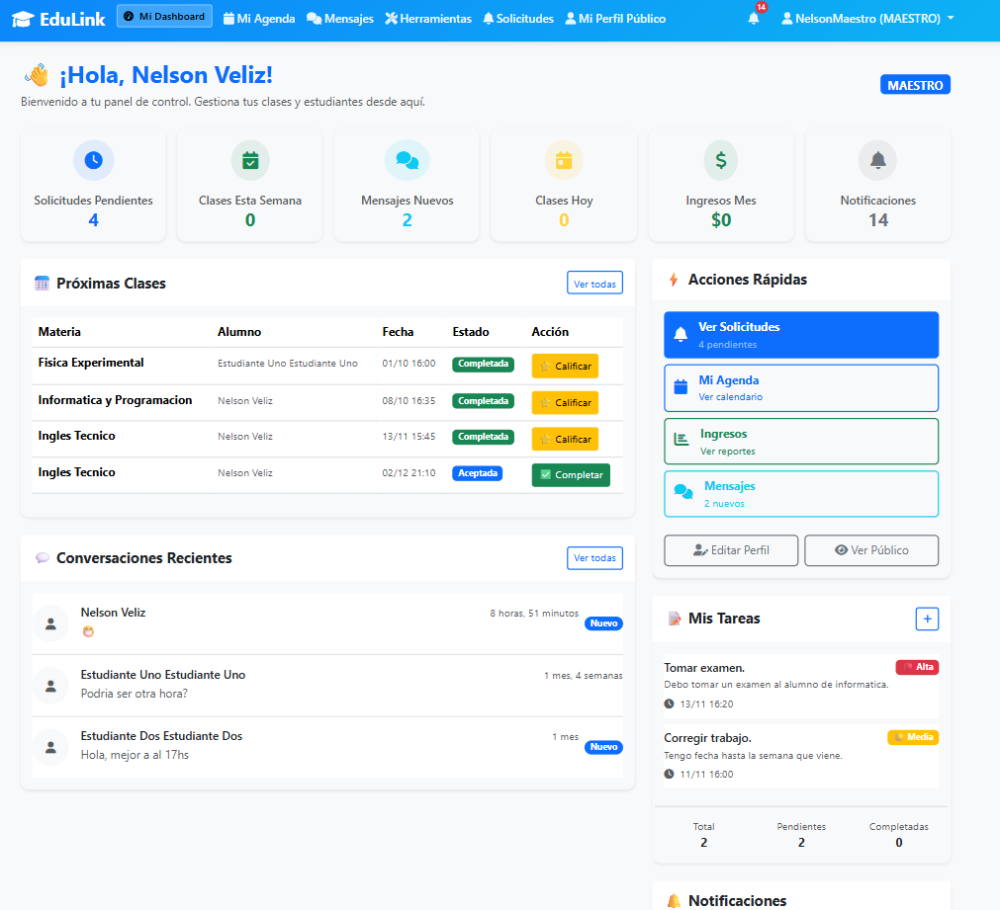

---

### 👨‍🏫 Conexión Alumno–Profesor

- Búsqueda de profesores con filtros por categoría/materia, ubicación geográfica y disponibilidad horaria.
- Perfil público detallado del profesor: materias, precio por hora, modalidad, idiomas, calificaciones y reseñas.
- Mapa interactivo con profesores cercanos georreferenciados.
- Calificaciones bidireccionales: el alumno califica al profesor y el profesor accede al rating del alumno.

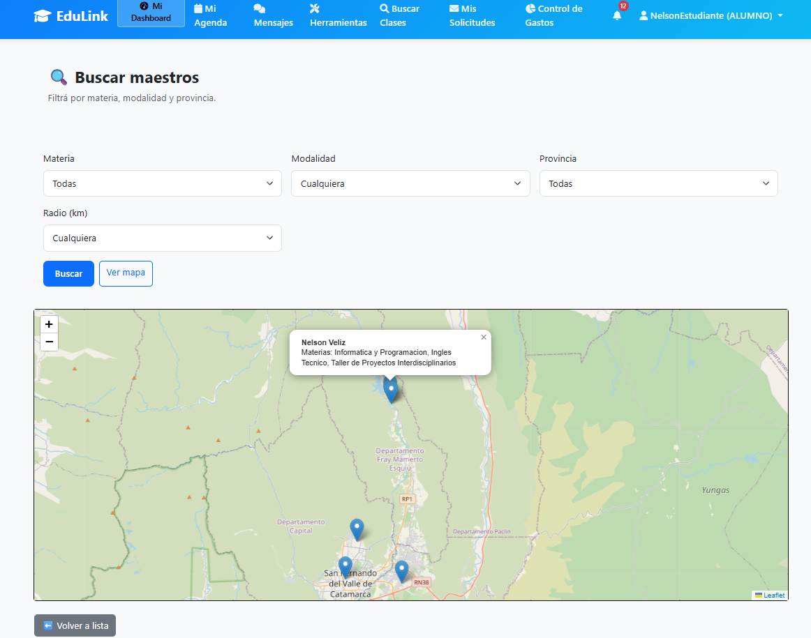

---

### 📋 Gestión de Solicitudes de Clase

Ciclo completo de solicitudes con estados rastreables:

| Estado | Descripción |
|--------|-------------|
| 🟡 Pendiente | Solicitud enviada, aguardando respuesta del profesor |
| 🟢 Aceptada | Profesor confirmó la clase; se agrega a la agenda de ambos |
| 🔴 Rechazada | Profesor declinó la solicitud |
| 🔵 Propuesta | Profesor sugiere otra fecha u horario |
| ⚫ Cancelada | El alumno canceló la solicitud |
| ✅ Completada | La clase se realizó correctamente |

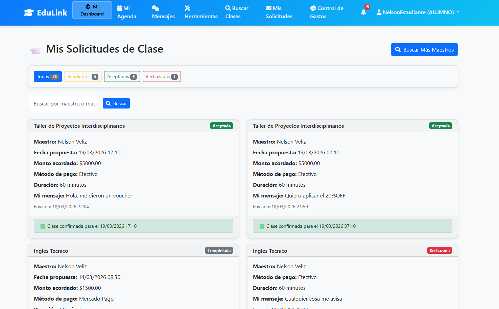

#### ⚙️ Funcionalidades

- Creación de solicitud con selección de fecha, hora y modalidad  
- Selección dinámica de profesor  
- Adjuntos opcionales (comentarios o detalles adicionales)  
- Notificaciones automáticas ante cambios de estado  

---

### 📅 Confirmación de Fecha / Reprogramación

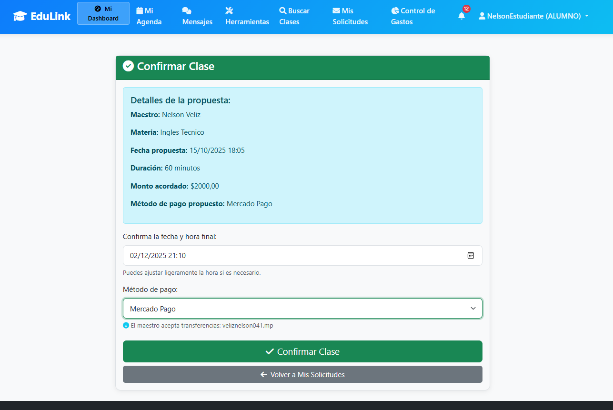

- El profesor puede:
  - Aceptar la fecha propuesta  
  - Rechazar la solicitud  
  - Proponer una nueva fecha u horario  

- El alumno puede:
  - Confirmar la nueva propuesta  
  - Cancelar la solicitud  

- Validación automática de conflictos de horario  
- Actualización en tiempo real del estado de la solicitud  

---

### 💬 Sistema de Mensajería Interna

- Chat en tiempo real entre alumno y profesor.
- Historial de conversaciones con contador de mensajes no leídos.
- Notificaciones por cada nuevo mensaje (en plataforma y por email).
- Conversaciones iniciables desde el menú o desde el perfil del usuario.

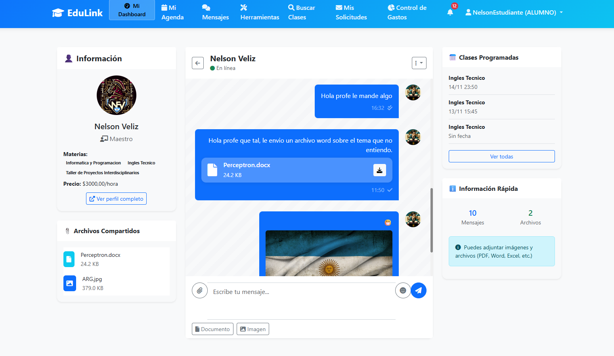

---

### 📅 Agenda y Calendario Interactivo

- Calendario personal con clases programadas y eventos personales.
- Las clases aceptadas se agregan automáticamente a la agenda de ambas partes.
- Prevención de conflictos de horario entre clases y eventos.
- Cambio de estado de eventos/tareas desde el calendario.
- Exportación de la agenda a formato Excel (disponible para profesores).

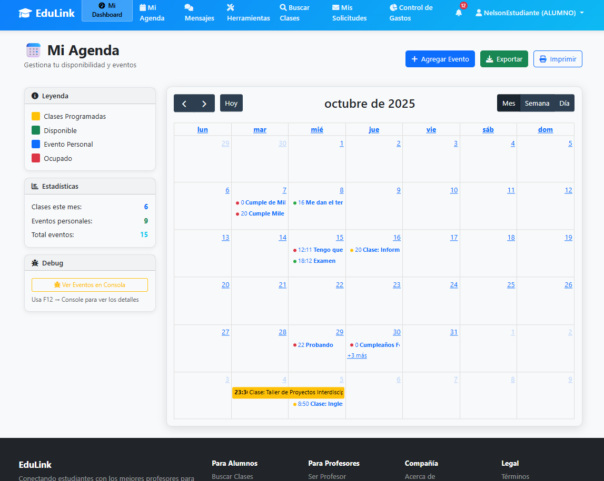

---

### 🧰 Herramientas de Estudio Integradas

Herramientas exclusivas para facilitar el proceso de aprendizaje:

| Herramienta | Descripción |
|-------------|-------------|
| 🧮 Calculadora científica | Operaciones avanzadas |
| 📝 Bloc de notas | Apuntes rápidos integrados |
| 🕒 Pomodoro Timer | Técnica de estudio por bloques de tiempo |
| 📘 Gestor de tareas | Organización de actividades académicas |
| 🔢 Conversor de unidades | Conversiones de medidas y magnitudes |
| 📊 Generador de gráficos | Visualización de datos |
| 📚 Biblioteca de fórmulas | Referencia matemática y científica |
| 🧪 Tabla periódica | Tabla periódica interactiva |
| 🌎 Traductor automático | Traducción integrada en la plataforma |
| 📖 Diccionario | Consulta de definiciones |

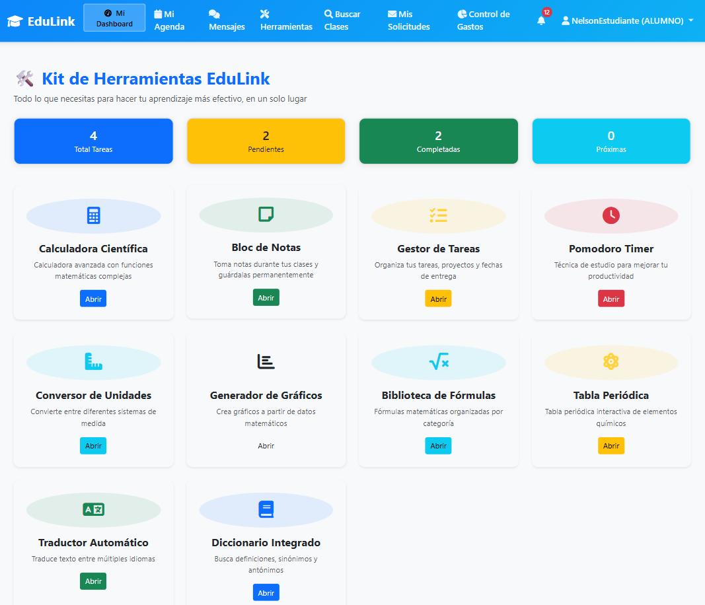

---

### 🔔 Sistema de Notificaciones

- Notificaciones internas en plataforma (campana con contador de no leídas).
- Notificaciones por email ante eventos relevantes (nueva solicitud, cambio de estado, nuevo mensaje).
- Página "Mis notificaciones" con historial completo y filtros.
- Marcado individual o masivo como leídas.

---

### 💳 Control Financiero

#### 👨‍🎓 Control de Gastos (Alumno)

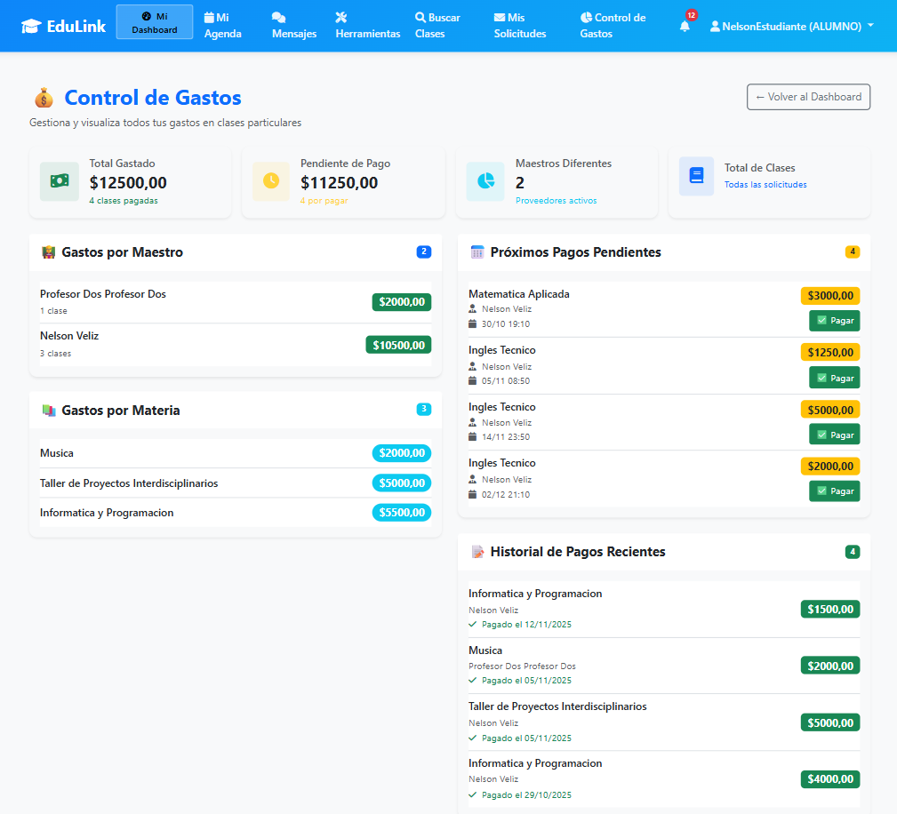

- Historial completo de gastos por clases  
- Filtros por fecha, profesor o estado  
- Visualización de total gastado  
- Registro automático al completar una clase  

---

#### 👨‍🏫 Control de Ingresos (Profesor)

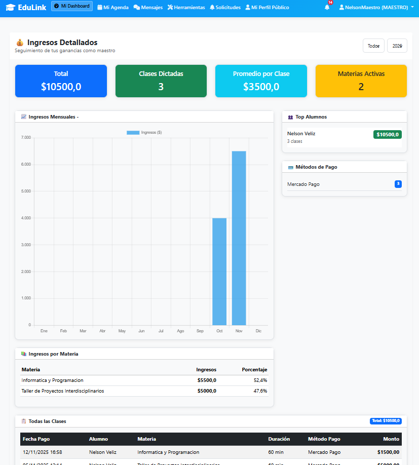

- Registro de ingresos por clases realizadas  
- Filtros por rango de fechas, materia o alumno  
- Cálculo automático de ingresos totales  
- Visualización clara en tabla dinámica  

---

#### 📊 Características Generales

- Datos actualizados en tiempo real  
- Integración con el sistema de clases completadas  
- Base para futuras estadísticas financieras

---

### 🛠️ Panel de Administración

- Gestión completa de usuarios: crear, editar, eliminar, bloquear y asignar roles.
- Supervisión de todas las clases del sistema y su estado actual.
- Estadísticas globales desglosadas por rol y período.
- Control de acceso: habilitar o deshabilitar registro y login de usuarios.

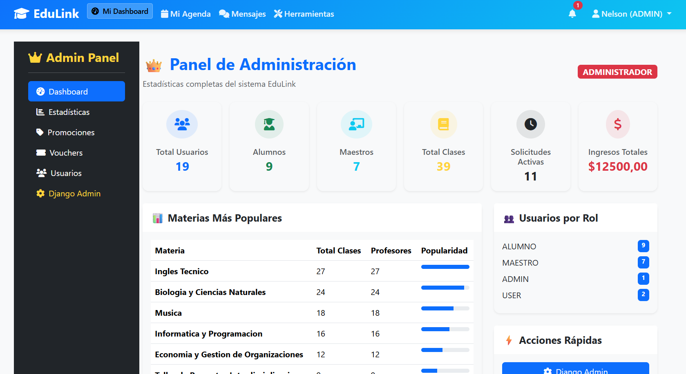

---

## 🛠️ Tecnologías Utilizadas

| Capa | Tecnología |
|------|------------|
| Backend | Python 3.12, Django 5.x |
| API | Django REST Framework |
| Base de datos | PostgreSQL |
| Frontend | HTML5, CSS3, JavaScript, Bootstrap 5 |
| Mapas | Leaflet.js + geocodificación inversa |
| Gráficos | Chart.js |
| Comunicación en tiempo real | WebSockets (Django Channels) |
| Exportación | openpyxl (Excel) |
| Servidor (producción) | Nginx + Gunicorn |

---

## 📦 Instalación

### Requisitos previos

- Python 3.12+
- PostgreSQL 16+
- Git

### Pasos

```bash
# 1. Clonar el repositorio
git clone https://github.com/TU_USUARIO/EduLink.git
cd EduLink

# 2. Crear y activar entorno virtual
python -m venv venv
source venv/bin/activate       # Linux/Mac
venv\Scripts\activate          # Windows

# 3. Instalar dependencias
pip install -r requirements.txt

# 4. Configurar variables de entorno
cp .env.example .env
# Editar .env con tus credenciales de base de datos, secret key y email

# 5. Aplicar migraciones
python manage.py migrate

# 6. Crear superusuario
python manage.py createsuperuser

# 7. Ejecutar servidor de desarrollo
python manage.py runserver
```

Accedé a `http://127.0.0.1:8000` en tu navegador.

---

## 🗂️ Estructura del Proyecto

```
EduLink/
├── apps/
│   ├── usuarios/        # Registro, login, perfiles y roles
│   ├── solicitudes/     # Ciclo completo de solicitudes de clase
│   ├── agenda/          # Calendario y gestión de eventos
│   ├── mensajeria/      # Chat interno entre usuarios
│   ├── finanzas/        # Ingresos y gastos
│   ├── calificaciones/  # Reseñas y ratings
│   └── administracion/  # Panel de gestión del sistema
├── assets/              # Imágenes y recursos estáticos
├── templates/           # Templates HTML
├── static/              # CSS, JS, íconos
├── manage.py
└── requirements.txt
```

---

## 🔐 Variables de Entorno

Crear un archivo `.env` en la raíz del proyecto con los siguientes valores:

```env
SECRET_KEY=tu_clave_secreta
DEBUG=True

DB_NAME=edulink_db
DB_USER=tu_usuario
DB_PASSWORD=tu_contraseña
DB_HOST=localhost
DB_PORT=5432

EMAIL_HOST=smtp.gmail.com
EMAIL_PORT=587
EMAIL_HOST_USER=tu_email@gmail.com
EMAIL_HOST_PASSWORD=tu_contraseña_de_app
```

---

## 🚀 Despliegue en Producción

El entorno de producción utiliza:

- **Servidor:** Linux con Nginx como proxy inverso y Gunicorn como servidor WSGI.
- **Base de datos:** PostgreSQL dedicado con backups automáticos.
- **SSL:** Certificado HTTPS activo.
- **Email:** Servidor SMTP configurado para notificaciones.

---

## 📬 Contacto

**Nelson Fernando Veliz**  
Desarrollador Web & Software – Semi Senior

🔗 LinkedIn: [nelson-fernando-veliz](https://www.linkedin.com/in/nelson-fernando-veliz-395423283/)  
📧 Email: veliznelson041@gmail.com

---
